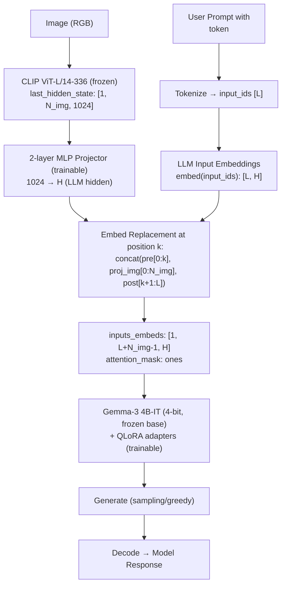

# Gemma-CLIP: An Efficient LLaVA-style Vision-Language Model for Scientific Reasoning

> A small Vision-Language Model (sVLM) designed for complex multimodal reasoning, capable of being trained on consumer-grade hardware.

<br>

## 1. Problem
Large Vision-Language Models (VLMs) are computationally expensive to train and fine-tune, which limits their accessibility for researchers and developers who have access only to consumer-grade hardware. This project tackles the challenge of building a powerful yet efficient VLM for specialized domains like scientific reasoning.

<br>

## 2. My Solution
This work demonstrates that by leveraging state-of-the-art **Parameter-Efficient Fine-Tuning (PEFT)** techniques, it is possible to build a potent sVLM capable of nuanced scientific understanding on a single 24GB GPU. The model adopts the LLaVA architecture, integrating a pre-trained `google/gemma-3-4b-it` language model with an `openai/clip-vit-large-patch14-336` vision encoder.

#### Architecture
The architecture is designed for modularity and efficiency, comprising a frozen vision encoder, a frozen LLM backbone with QLoRA adapters, and a trainable MLP projector.


#### Key Features
- **Parameter-Efficient Fine-Tuning (PEFT)**: To make training feasible on limited hardware, we employ **Quantization** (loading the Gemma model in 4-bit) and **QLoRA** (training only low-rank adapters).
- **Selective Training**: Only the MLP projector and the QLoRA adapters are updated during training, keeping the multi-billion parameter vision and language backbones frozen to maximize efficiency.
- **Performance Optimization**: We use **FlashAttention-2** and **bfloat16** precision to accelerate computation and reduce memory usage.

<br>

## 3. Impact & Results
-   **High Accuracy on a Lean Budget**: Achieved **51.03% accuracy** on the full test split of the ScienceQA benchmark, demonstrating strong scientific reasoning capabilities.
-   **Hardware Accessibility**: The entire fine-tuning process was successfully conducted on a single 24GB consumer GPU, proving the viability of this approach for researchers without access to large-scale industrial hardware.

| Dataset | Total Samples | Correct Predictions | Accuracy |
| :--- | :---: | :---: | :---: |
| ScienceQA (Test Split) | 4241 | 2164 | **51.03%** |

<br>

## 4. How to Use

#### a. Setup
**Prerequisites**
- NVIDIA GPU with at least 24GB VRAM (e.g., RTX 3090, RTX 4090).
- CUDA 11.8 or newer.
- Conda for environment management.

**Installation**
```bash
# 1. Create and activate the Conda environment
conda create -n svlm python=3.10 -y
conda activate svlm

# 2. Install PyTorch (ensure CUDA version matches your system)
pip install torch==2.1.2+cu118 torchvision==0.16.2+cu118 --index-url [https://download.pytorch.org/whl/cu118](https://download.pytorch.org/whl/cu118)

# 3. Install project dependencies
pip install -r requirements.txt

# 4. Authenticate with Hugging Face to access Gemma
huggingface-cli login
```

#### b. Training
The `train_svlm_gemma_clip_scienceqa.py` script handles the entire training pipeline.
```bash
python train_svlm_gemma_clip_scienceqa.py \
  --output_dir ./outputs \
  --num_train_epochs 1 \
  --per_device_train_batch_size 1 \
  --gradient_accumulation_steps 8 \
  --learning_rate 1e-4 \
  --bf16 True \
  --use_flash_attention_2 True \
  --gradient_checkpointing True \
  --lora_r 64 \
  --lora_alpha 128 \
  --max_train_samples 5000 # Remove this line for a full run
```

#### c. Inference
Use the `inference_gemma_clip.py` script to load a trained model and generate responses.
```bash
python inference_gemma_clip.py \
  --adapter_dir ./outputs/lora_adapter \
  --projector_path ./outputs/projector.pt \
  --tokenizer_dir ./outputs/tokenizer \
  --image_path ./assets/sample_diagram.png \
  --question "Based on the diagram, what process is illustrated?" \
  --context "The diagram shows the movement of water between the Earth's surface and the atmosphere." \
  --choices "A) Photosynthesis; B) The Water Cycle; C) The Carbon Cycle" \
  --max_new_tokens 256
```
<br>

## 5. End-to-End Flow (LLaVA‑style MLP Fusion)

