# Gemma-CLIP: An Efficient LLaVA-style Vision-Language Model for Scientific Reasoning

This repository contains the official implementation for **Gemma-CLIP**, a small Vision-Language Model (sVLM) designed for complex multimodal reasoning.  
Our work demonstrates that by leveraging state-of-the-art parameter-efficient fine-tuning (PEFT) techniques, it is possible to build a powerful sVLM capable of nuanced scientific understanding on consumer-grade hardware.

The model adopts the LLaVA architecture, integrating a pre-trained `google/gemma-3-4b-it` language model with a `openai/clip-vit-large-patch14-336` vision encoder.  
The core of our contribution lies in the efficient training strategy, which freezes the large backbones and exclusively trains a lightweight MLP projector alongside QLoRA adapters.  
This approach enables fine-tuning on a single 24GB GPU without sacrificing performance on the target task: Multimodal Chain-of-Thought (MCoT) reasoning on the ScienceQA benchmark.

---

## 1. Architecture

The architecture is designed for modularity and efficiency:

- **Vision Encoder (Frozen):** The CLIP-ViT-L/14 model encodes an input image into a sequence of patch embeddings.
- **LLM Backbone (Frozen + QLoRA):** The Gemma-3-4B-IT model is loaded in 4-bit precision. While its base weights are frozen, QLoRA adapters are inserted into its attention and feed-forward layers, allowing for efficient tuning.
- **Projector (Trainable):** A 2-layer MLP maps the vision embeddings from the CLIP hidden space to the Gemma-3 embedding space. These projected embeddings act as a "soft visual prompt" for the LLM.

```
Input Image 🖼️
      │
      ▼
┌──────────────────┐
│ CLIP ViT-L/14-336│ (Frozen)
│ Vision Encoder   │
└──────────────────┘
      │
      ▼ (Patch Embeddings)
┌──────────────────┐
│   MLP Projector  │ (Trainable)
└──────────────────┘
      │ (Mapped to LLM Space)
      │
      │             Input Text 📝
      │                   │
      └───────────────────▼──────────────────┐
                         ┌──────────────────┐
                         │ Gemma-3 4B-IT    │ (Frozen Base + Trainable QLoRA)
                         │ Language Model   │
                         └──────────────────┘
                                │
                                ▼
                         Generated Text 💬 (Reasoning + Answer)
```

---

## 2. Methodology

### Parameter-Efficient Fine-Tuning (PEFT)

To make training feasible on limited hardware, we employ several key techniques:

- **Quantization:** The Gemma-3 model is loaded in 4-bit using bitsandbytes, drastically reducing its memory footprint.
- **QLoRA (Quantized Low-Rank Adaptation):** Instead of fine-tuning the entire 4-billion-parameter LLM, we only train low-rank adapters injected into the model. This reduces the number of trainable parameters by several orders of magnitude.
- **Selective Training:** Only the MLP projector and the QLoRA adapters are updated during training, while the multi-billion parameter vision and language backbones remain frozen.

### Performance Optimization

- **FlashAttention-2:** When available (on NVIDIA Ampere architecture or newer), FlashAttention-2 is used to accelerate the attention computation and further reduce memory usage.
- **bfloat16 Precision:** Training is conducted in bfloat16 to balance numerical stability and performance.

---

## 3. Setup & Installation

### Prerequisites

- NVIDIA GPU with at least 24GB VRAM (e.g., RTX 3090, RTX 4090, A10G, L4).
- CUDA 11.8 or newer.
- Conda for environment management.

### Installation

1. Create and activate the Conda environment:
    ```bash
    conda create -n svlm python=3.10 -y
    conda activate svlm
    ```

2. Install PyTorch:  
   Ensure the CUDA version matches your system's driver.
    ```bash
    pip install torch==2.1.2+cu118 torchvision==0.16.2+cu118 --index-url https://download.pytorch.org/whl/cu118
    ```

3. Install project dependencies:  
   We recommend creating a `requirements.txt` file with the content below and running `pip install -r requirements.txt`.

    ```text
    transformers>=4.50.0
    datasets==2.19.0
    accelerate==0.30.1
    peft==0.10.0
    bitsandbytes==0.41.3
    trl==0.8.6
    # Optional but highly recommended for performance
    flash-attn==2.5.8 --no-build-isolation
    ```

    ```bash
    pip install -r requirements.txt
    ```

4. **Hugging Face Authentication:**  
   This project requires access to `google/gemma-3-4b-it`, a gated model.
   - Visit the [Gemma-3 4B-IT model page](https://huggingface.co/google/gemma-3-4b-it) and accept the license terms.
   - Log in via the CLI:
     ```bash
     huggingface-cli login
     ```

---

## 4. Usage

### Training

The `train_svlm_gemma_clip_scienceqa.py` script handles the entire training pipeline.

```bash
python train_svlm_gemma_clip_scienceqa.py \
  --output_dir ./outputs \
  --num_train_epochs 1 \
  --per_device_train_batch_size 1 \
  --gradient_accumulation_steps 8 \
  --learning_rate 1e-4 \
  --bf16 True \
  --use_flash_attention_2 True \
  --gradient_checkpointing True \
  --lora_r 64 \
  --lora_alpha 128 \
  --max_train_samples 5000 # Remove for full run
```

- `output_dir`: Directory to save the trained projector, LoRA adapter, and tokenizer.
- `gradient_accumulation_steps`: The effective batch size will be `per_device_train_batch_size * gradient_accumulation_steps`. Adjust based on your GPU memory.

### Inference

The `inference_gemma_clip.py` script loads the trained components and performs generation on a given image and prompt.

```bash
python inference_gemma_clip.py \
  --adapter_dir ./outputs/lora_adapter \
  --projector_path ./outputs/projector.pt \
  --tokenizer_dir ./outputs/tokenizer \
  --image_path ./assets/sample_diagram.png \
  --question "Based on the diagram, what process is illustrated?" \
  --context "The diagram shows the movement of water between the Earth's surface and the atmosphere." \
  --choices "A) Photosynthesis; B) The Water Cycle; C) The Carbon Cycle" \
  --max_new_tokens 256
```

---

## 5. Example Result

**Input Image:** `./assets/sample_diagram.png`

**Prompt:**

```
Question: Based on the diagram, what process is illustrated?
Context: The diagram shows the movement of water between the Earth's surface and the atmosphere.
Choices: A) Photosynthesis; B) The Water Cycle; C) The Carbon Cycle
```

**Model Output:**
```
<start_of_turn>model
Step-by-step reasoning:
The user has provided an image and a question about the process it illustrates.
1. Analyze the image: The diagram contains labels such as "Evaporation," "Condensation," "Precipitation," and "Collection." These are the key stages of the water cycle.
2. Analyze the text: The context explicitly mentions "movement of water between the Earth's surface and the atmosphere," which is the definition of the water cycle.
3. Evaluate the choices:
    - A) Photosynthesis is a biological process in plants. This is incorrect.
    - B) The Water Cycle perfectly matches the visual evidence and the context.
    - C) The Carbon Cycle involves the movement of carbon, not primarily water. This is incorrect.
4. Conclusion: The evidence from both the image and text points to the Water Cycle.

Final Answer:
B) The Water Cycle
<end_of_turn>
```

---

## 6. Citation

If you find this work useful for your research, please consider citing:

```bibtex
@misc{gemma-clip-2024,
  author       = {Kang, Ho Seung},
  title        = {Gemma-CLIP: An Efficient LLaVA-style Vision-Language Model for Scientific Reasoning},
  year         = {2024},
  publisher    = {GitHub},
  journal      = {GitHub repository},
  howpublished = {\url{https://github.com/mAn-He/gemmaclip}}
}
```

---

## 7. License

This project is licensed under the Apache License 2.0. Please see the LICENSE file for details.  
The use of third-party models (Gemma, CLIP) is subject to their respective licenses.

## 8. Evaluation (ScienceQA)

- **Dataset**: ScienceQA (full test split)
- **Total processed**: 4241
- **Labeled total**: 4241
- **Correct**: 2164
- **Accuracy**: 51.03%

Artifacts (example):
- `eval_scienceqa_clean/metrics.json`
- `eval_scienceqa_clean/predictions.jsonl`
- `eval_scienceqa_clean/report.md` (qualitative samples)


## 9. End-to-End Flow (LLaVA‑style MLP Fusion)

```mermaid
flowchart TD
  A["Image (RGB)"] --> B["CLIP ViT-L/14-336 (frozen)\nlast_hidden_state: [1, N_img, 1024]"]
  B --> C["2-layer MLP Projector (trainable)\n1024 → H (LLM hidden)"]

  D["User Prompt with <image> token"] --> E["Tokenize → input_ids [L]"]
  E --> F["LLM Input Embeddings\nembed(input_ids): [L, H]"]

  C --> G["Embed Replacement at <image> position k:\nconcat(pre[0:k], proj_img[0:N_img], post[k+1:L])"]
  F --> G

  G --> H["inputs_embeds: [1, L+N_img-1, H]\nattention_mask: ones"]
  H --> I["Gemma‑3 4B‑IT (4-bit, frozen base)\n+ QLoRA adapters (trainable)"]
  I --> J["Generate (sampling/greedy)"]
  J --> K["Decode → Model Response"]
```



Notes:
- Vision and LLM backbones are frozen; only the 2‑layer MLP projector and LoRA adapters are trained.
- Fusion is performed by replacing the single `<image>` token embedding with the projected CLIP token sequence (no cross‑attention/Q‑former).
- Attention mask uses ones over the effective sequence length (unpadded in our setup).
